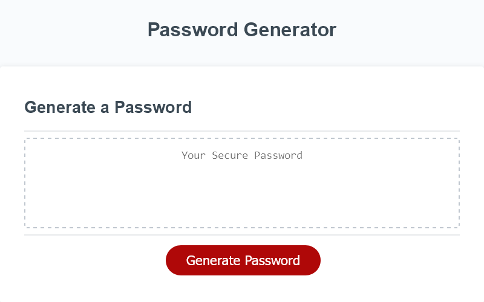
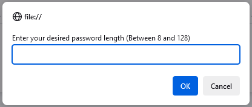
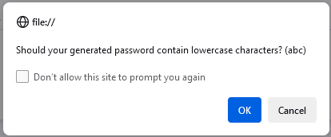

# Random Password Generator

## Description
This application can be used to generate a password as short as 8 characters and as long as 128 characters. The actual size and characters in use will depend on user input. It's main purpose is to aid in the creation of hard to guess passwords and can be used as often as is required.

Throughout this project I have learned how to create and call functions and manipulate arrays in order to make the application work.

### Generate Button

### User Inputs

This application can be found on [Github Pages.](https://applepieorchard.github.io/random-password-generator/)

## Installation

N/A

## Usage

To use this application click the Generate Password button, enter a number into the popup window given, then select the characters you want the generator to use in your password by clicking ok for characters you want and cancel for characters you wish to discard. Once all of these choices have been made your password will appear in the field and can be copied as needed.

## Credits

N/A

## License

This Project is subject to the [MIT License.](LICENSE)